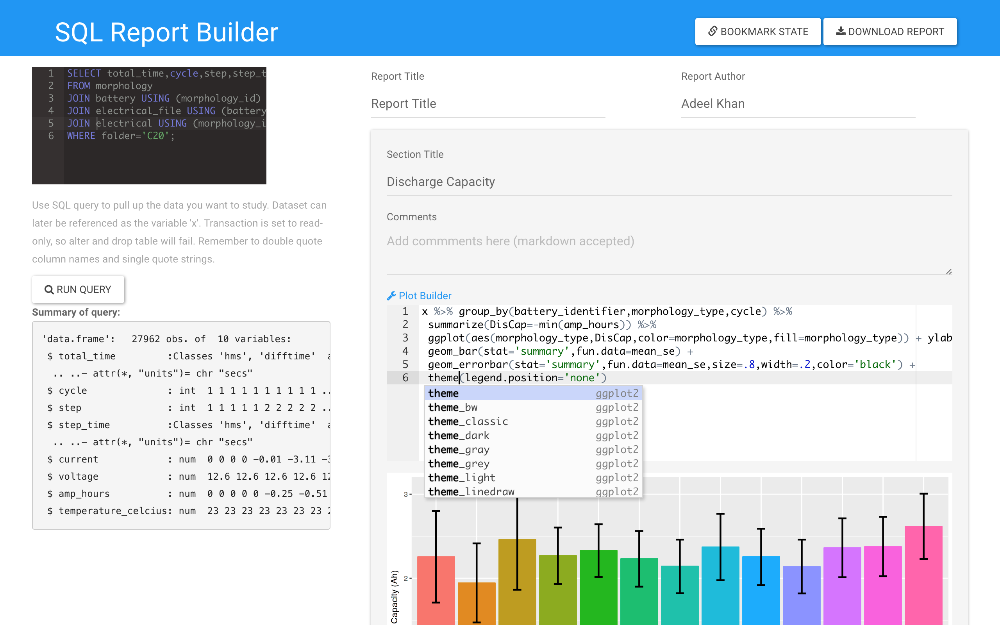
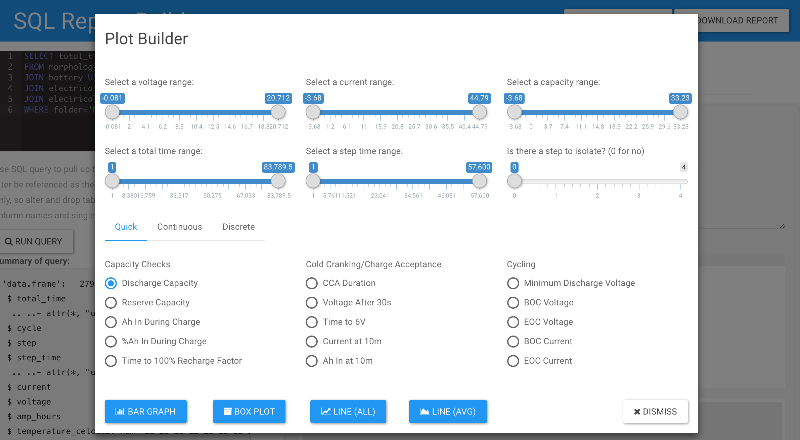

# Report Builder

SQL Report Building platform that allows for data querying, visualization, and reporting using a RESTful API. Built on Shiny and jQuery. Configured to run with a VPS connection to a PostgreSQL RDS instance.

## Querying the database

The black text input field is used to construct the SQL query, which features autocomplete for common PostgreSQL functions, as well as table and column names from the database. After running the query, a summary of the table returned will be shown below.

## Adding sections

Report sections can be added or removed using the buttons. Each section features a title, commentary about the section, and a plot. The plot will be generated below as you type. The text input field will autocomplete for common functions in base R, dplyr, tidyr, ggplot, and column names for the database.

### Plot builder

The plot builder is designed to help increase the speed at which you can create the most common plots. This includes:

* Quick: common prepackaged charts
* Continuous: plotting a continuous variable against another, e.g. voltage vs time
* Discrete: plotting a discrete variable against either another discrete variable, e.g. minimum discharge voltage vs type, or a discrete variable against a continuous variable, e.g. minimum discharge voltage vs cycle

These charts can be represented as a bar chart, box plot, line chart by battery, or line chart with SEM ribbons by type.

You can also optionally filter down the portion of the dataset you wish to plot using the sliders above.

## Saving and sharing your work

The bookmark state button will generate an http address featuring the REST api necessary to share your report with others, including your SQL query, sections, plots, and commentary. This feature is also useful for checking in on reports that are updating over time.

Downloading the report will get you a zip file containing the Rmarkdown source file, an html notebook, a pdf report, and an rds file containing the dataset. The Rmarkdown file also contains the connection string to the database and SQL query used to generate the report, if you wish to use that rather than the supplied rds file. Useful for advanced customization and sharing pdf reports with others.
